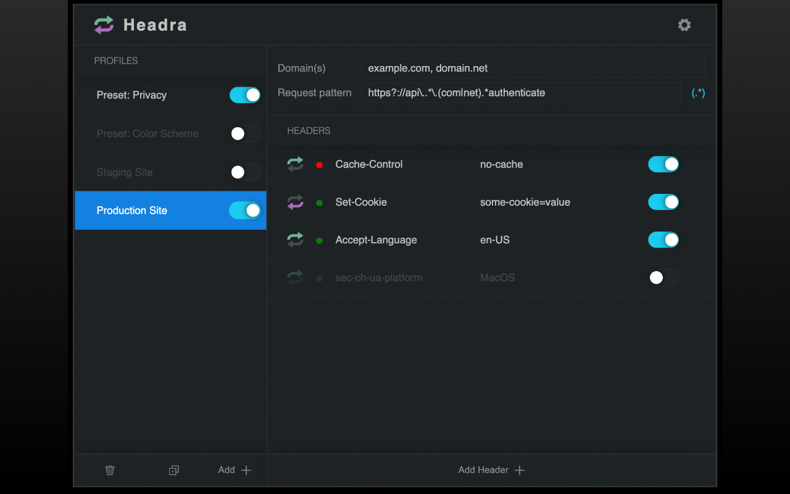

# Headra

Cross-browser request and response modification extension/add-on.

- Set, append, or remove HTTP request/response headers.
- Add, or modify request/response body, and status (in supported browsers).

## Marketplaces

- [Google Chrome](https://chromewebstore.google.com/detail/headra/kkpnknfbjbfjdoghgjajogdmejjdlofo)
- [Firefox](https://addons.mozilla.org/en-US/firefox/addon/headra/) (Currently doesn't support "Intercepts")
- [Microsoft Edge](https://microsoftedge.microsoft.com/addons/detail/headra/ccfeoagdjmlbkjhnhbfpcjnoepkackbh)
- **Safari**: _Not yet available_

## Building from Source

- `npm i`
- `npm run build` (for Chrome, Safari, Edge)
- `npm run zip:firefox` (for Firefox)

## Loading Built Extension

**Note:** You'll need to follow the instructions in **Building from Source** first.

### Chrome and Edge

- Navigate to `about://extensions` in the address bar.
- Turn on **Developer Mode**.
- Click on **Load Unpacked**
- Find the **build > chrome-mv3** folder in the project, and click **Select**.

### Firefox

> [!NOTE]
> Firefox requires signed Add-ons, but this requirement can be disabled in the [Firefox Developer Edition](https://www.firefox.com/en-US/channel/desktop/developer/). That's what the following instructions are for.

- Navigate to `about:config` in the address bar.
- Search for the `xpinstall.signatures.required` setting, and toggle it to `false`.
- Navigate to `about:addons` in the address bar.
- Click the ⚙ button to **Install Add-on From File...**
- Find the **build > headra-_\<version\>_-firefox.zip** file in the project, and click **Open**.

### Safari (temporary install)

> [!NOTE]
> As much as I can tell, Safari has a lot of hoops to jump through to get a _permanently_-installed extension. The instructions provided will only allow a _temporarily_-installed extension... which gets removed whenever the browser is closed, and has limited feature support. It's best to find the extension in the App Store when/if one becomes available.

- Click the top-left browser name menu, and go to **Settings**.
- Go to the **Advanced** tab, and check **Show features for web developers**.
- Go to the **Developer** tab, and **Add Temporary Extension...**
- Find the **build > chrome-mv3** folder in the project, and click **Select**.
